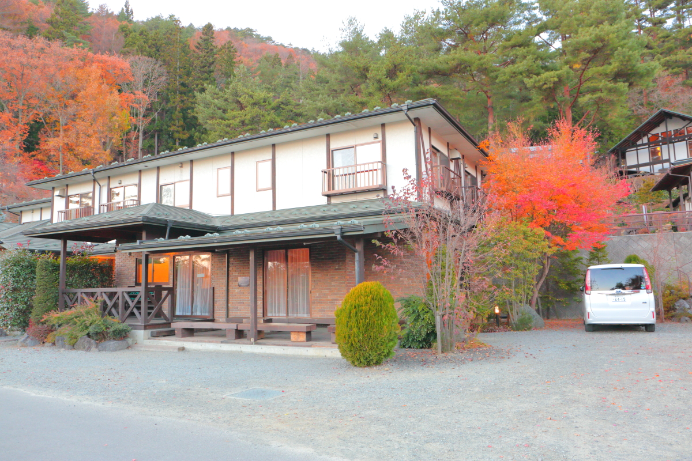

# mt_fuji

<html lang="ja">
 <head>
  <meta charset="utf-8" />
 

<link href="https://cdnjs.cloudflare.com/ajax/libs/lightbox2/2.7.1/css/lightbox.css" rel="stylesheet">
   
</head>

<body>

  モバイル端末をお使いの場合は、画面を横向きにするとより見やすくご覧頂けます。

<h1><marquee behavior="alternate">!!! 河口湖から望む富士山 !!!</marquee></h1>

2023、河口湖_bann。

                              

<marquee direction="right" scrollamount="20" width="30%">(^_^)/~hada</marquee>

	
	
<h2><marquee behavior="alternate">!!! 2023年12月2-3日、河口湖!!!</marquee></h2>
	
<h3>↓ 画像はクリックで拡大、スライドショー表示します。</h3>
<section><h4>2023年12月2-3日</h4></section> 

	  
河口湖カントリーコテージban！

 

2023年12月2日、夕方の写真！

12月3日、朝の写真！

<!--
-->
  

以下、動画  高速道路上から見えた富士山の勇姿

<iframe width="560" height="315" src="https://www.youtube.com/embed/DH69DnHAWCs?si=q-w-xYv8CwA_hNAL" title="YouTube video player" frameborder="0" allow="accelerometer; autoplay; clipboard-write; encrypted-media; gyroscope; picture-in-picture; web-share" allowfullscreen></iframe> 

以下、高速上のおかしな車たち

<iframe width="560" height="315" src="https://www.youtube.com/embed/SMJPn5XTurI?si=WPdzDmpveQpTWfCc" title="YouTube video player" frameborder="0" allow="accelerometer; autoplay; clipboard-write; encrypted-media; gyroscope; picture-in-picture; web-share" allowfullscreen></iframe> 

<iframe width="560" height="315" src="https://www.youtube.com/embed/yyDd0GfGsws?si=AnAfBOrDmktfOn2O" title="YouTube video player" frameborder="0" allow="accelerometer; autoplay; clipboard-write; encrypted-media; gyroscope; picture-in-picture; web-share" allowfullscreen></iframe>

                              

  

 

<!-- フッタ -->
 <footer>
 Copyright 2023/12/03 S.Hada
 </footer>

</body>
</html>
